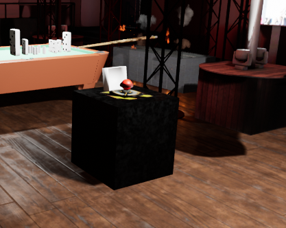
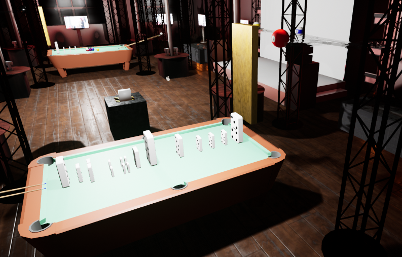
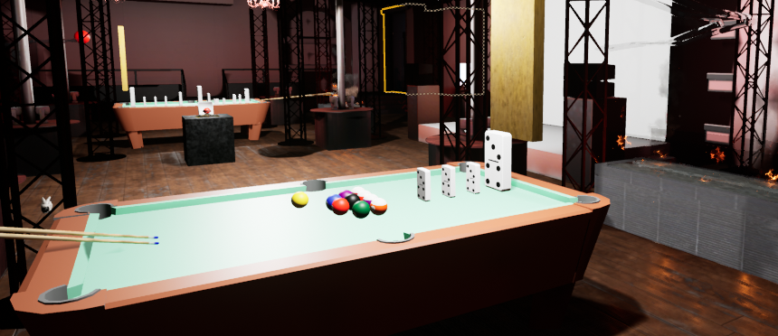
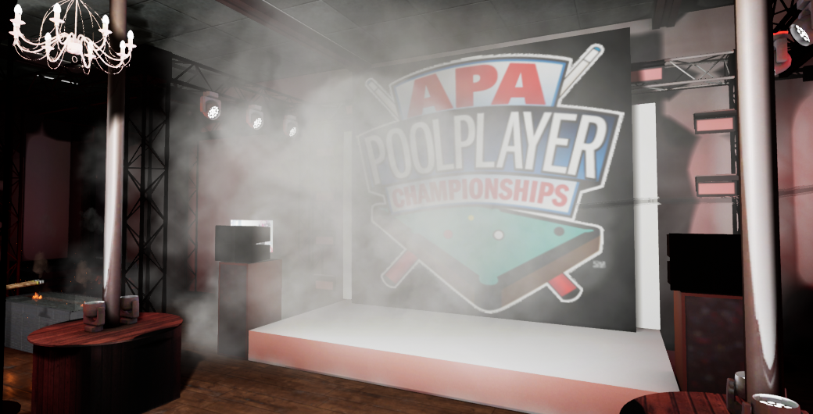
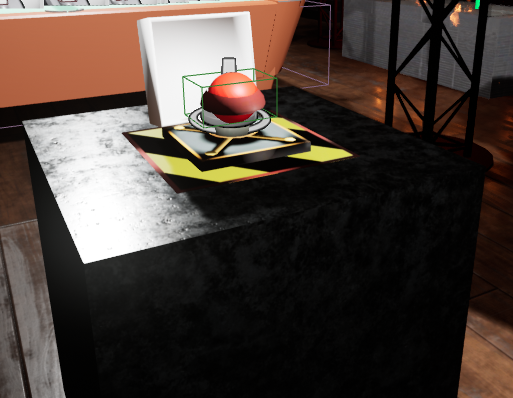
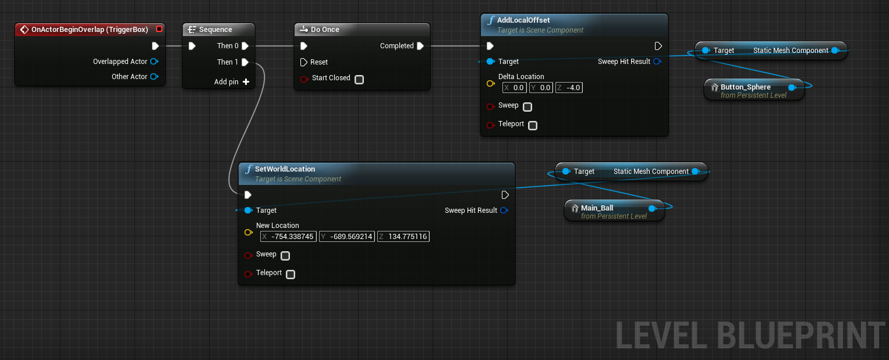

# Documentation
## Concept
Sequence of emblematic events that build an entertaining parade that sponsors a famous club in Moscow. The club has two main stages, contemporary and youth music; Pool tables, drinks, entertainment and more.
## Sumary of sequence
The event begins when the guest presses a striking button in the center of the club, which will automatically spawn a heavy ball on the first pool table, which hits a domino sequence.

  

The sequence of dominos pushes a first billiard ball that will cover half of the establishment passing on the back stage.

  

At the end of the course of the first billiard balls, the last one will fall on the second pool table, on which there is a pile of different balls that will push a final sequence of dominos and will end up sinking in the corners of the table.

  

With the fall of the last domino, a wave of smoke will fill the main stage while a last ball of steel runs through the installations. At the end of the last ball journey, the smoke will dissipate and the club logo will appear on the stage.

  

## Actors & Triggers
### Button

The button actor has a trigger box that collides with any other actor when overlapping, as the hand of the user is the only one capable of reaching it, it doesn't have any tag constraints. 
When the button is triggered, the actor [Ball](#Ball) spawns to begin the physics sequence.

The button actor has a trigger box that collides with any other actor when overlapping, as the hand of the user is the only one capable of reaching it, it doesn't have any tag constraints. 
When the button is triggered, the actor [Ball](#Ball) spawns to begin the physics sequence.

  

  

### Ball 