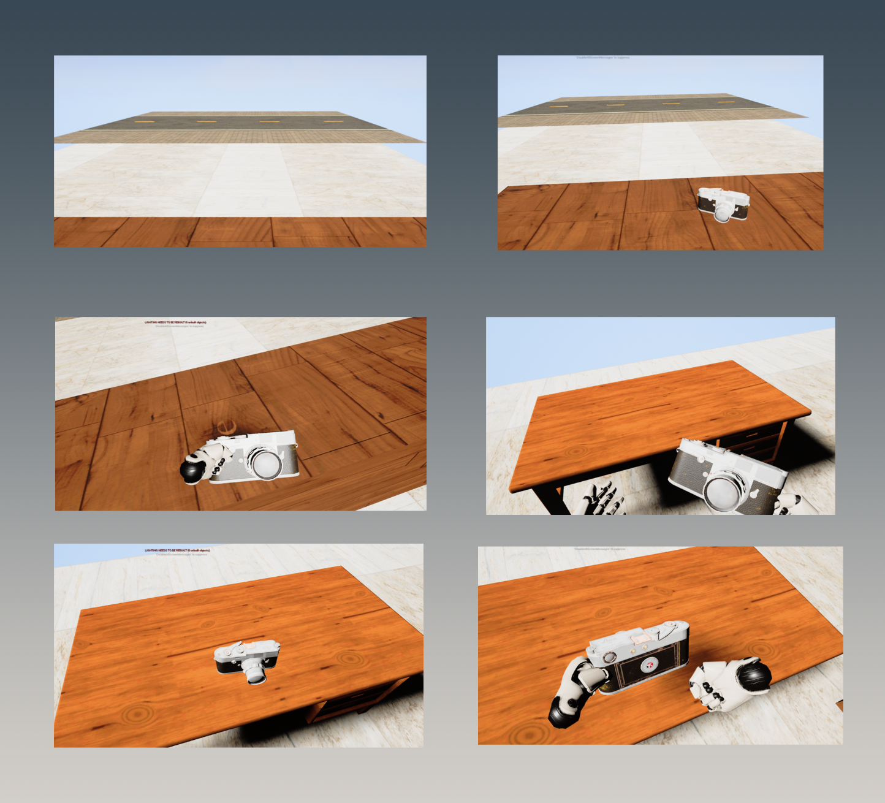

# Proposal
## Objectives
1. Develop a VR trainning experience.
2. Training has to have the most common rapair cases. 
3. Project has to be scalable.
## Topic
VR Experience to test and train future potential employees in a repair company.
## Summary
Repair Center is searching for more people to work with them, however, the company doesn't find people with skills to solve common problems. Instead of wasting more time finding trained people, Rapair Inc. wants a VR experience to test and train their potential new empleyees that will contain the most common repair situations.
## Tasks
### Asset Creation
1. Decide Style.
2. Search for style and assets examples.
3. Download required 3D models.
4. Create 3D required 3D models.
5. Modify models for disassemble feature.
### UI Interaction
1. Create canvas.
2. Dialogue feature.
3. VR dialogue interaction.
### Experience
1. Grab object interaction.
2. Take and move object interaction.
3. Place object feature.
### Trainning
1. Disassemble object interaction.
2. Change pieces interaction.
3. Assemble object interaction.
### Ending
1. Winning Canvas.
2. Exit/Restart Button.
## UE Design

  

